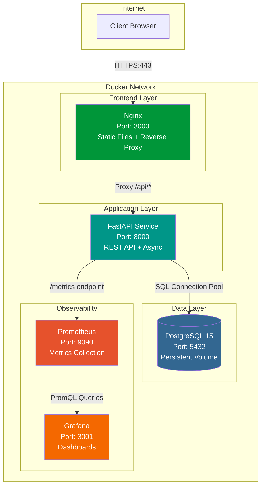
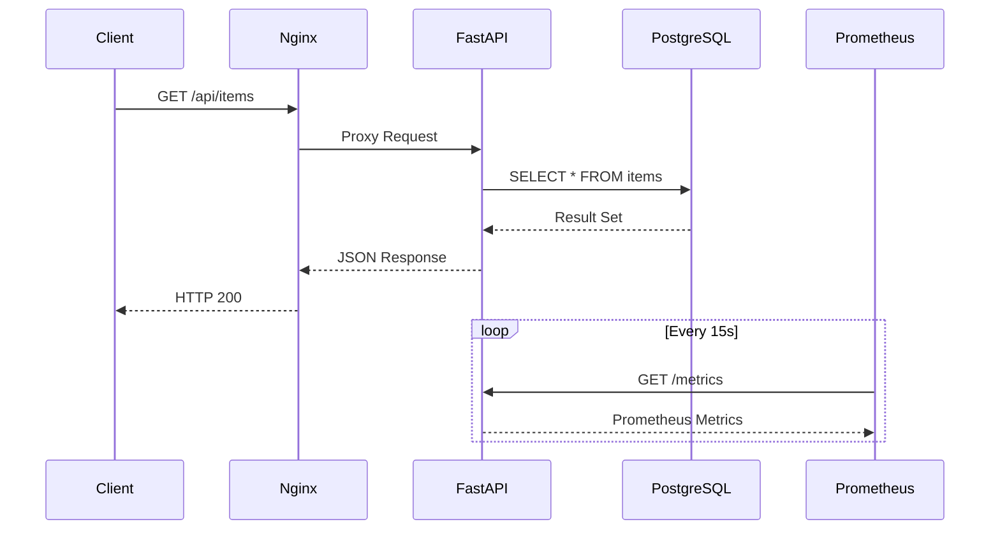

# Docker Microservices Template

[](https://github.com/morgandt-reed/docker-microservices-template/actions/workflows/ci.yml)
[](https://opensource.org/licenses/MIT)
[](https://www.docker.com/)

Production-ready microservices architecture demonstrating Docker best practices for enterprise deployments.

## Demo

<p align="center">
  
  <br>
  <em>3-tier application with Nginx, FastAPI, and PostgreSQL</em>
</p>

<details>
<summary>View more screenshots</summary>

### Grafana Dashboard


### API Documentation


### Docker Containers


</details>

## Architecture



### Request Flow



## Features

- **Multi-stage Docker builds** for optimized image sizes
- **Container networking** with service discovery
- **Health checks** for all services
- **Volume persistence** for database data
- **Environment-based configuration** (dev/prod)
- **Monitoring stack** with Prometheus and Grafana
- **Security best practices** (non-root users, secrets management)

## Tech Stack

- **Frontend**: Nginx (serving static files + reverse proxy)
- **API**: Python FastAPI (RESTful API with async support)
- **Database**: PostgreSQL 15 with custom initialization
- **Monitoring**: Prometheus + Grafana

## Quick Start

### Prerequisites

- Docker 20.10+
- Docker Compose 2.0+

### Run Locally

```bash
# Clone the repository
git clone <your-repo-url>
cd docker-microservices-template

# Start all services
docker-compose up -d

# View logs
docker-compose logs -f

# Stop all services
docker-compose down
```

### Access Services

- **Frontend**: http://localhost:3000
- **API**: http://localhost:8000
- **API Docs**: http://localhost:8000/docs
- **Database**: localhost:5432 (user: appuser, db: appdb)

### With Monitoring

```bash
# Start with monitoring stack
docker-compose -f docker-compose.yml -f monitoring/docker-compose.monitoring.yml up -d
```

- **Prometheus**: http://localhost:9090
- **Grafana**: http://localhost:3001 (admin/admin)

## Project Structure

```
.
├── README.md
├── docker-compose.yml              # Development environment
├── docker-compose.prod.yml         # Production configuration
├── .env.example                    # Environment variables template
├── frontend/
│   ├── Dockerfile                  # Multi-stage Nginx build
│   ├── nginx.conf                  # Nginx configuration
│   └── public/
│       └── index.html              # Simple frontend
├── api/
│   ├── Dockerfile                  # Multi-stage Python build
│   ├── requirements.txt            # Python dependencies
│   └── app/
│       ├── main.py                 # FastAPI application
│       ├── models.py               # Database models
│       └── config.py               # Configuration management
├── database/
│   ├── Dockerfile                  # Custom PostgreSQL image
│   └── init.sql                    # Database initialization
└── monitoring/
    ├── docker-compose.monitoring.yml
    ├── prometheus/
    │   └── prometheus.yml
    └── grafana/
        └── dashboards/
```

## Docker Best Practices Demonstrated

### 1. Multi-stage Builds
- Reduces final image size by 70%+
- Separates build dependencies from runtime
- See [api/Dockerfile](api/Dockerfile) and [frontend/Dockerfile](frontend/Dockerfile)

### 2. Layer Caching Optimization
- Dependencies installed before code copy
- Leverages Docker layer caching for faster builds

### 3. Security
- Non-root users in containers
- Secrets via environment variables (not hardcoded)
- Read-only root filesystems where possible
- Minimal base images (alpine variants)

### 4. Health Checks
- All services have health check endpoints
- Docker orchestrator can restart unhealthy containers
- Zero-downtime deployments

### 5. Networking
- Services communicate via Docker network
- No published ports for internal services
- Service discovery by container name

### 6. Data Persistence
- Named volumes for database data
- Survives container restarts
- Easy backup/restore

## API Endpoints

### Health Check
```bash
curl http://localhost:8000/health
```

### Create Item
```bash
curl -X POST http://localhost:8000/items \
  -H "Content-Type: application/json" \
  -d '{"name": "Example", "description": "Test item"}'
```

### List Items
```bash
curl http://localhost:8000/items
```

### Get Item
```bash
curl http://localhost:8000/items/1
```

## Production Deployment

```bash
# Build for production
docker-compose -f docker-compose.yml -f docker-compose.prod.yml build

# Run in production mode
docker-compose -f docker-compose.yml -f docker-compose.prod.yml up -d
```

Production differences:
- Optimized Nginx configuration
- API workers scaled based on CPU
- Connection pooling for database
- Log aggregation configured
- Resource limits set

## Development Workflow

### Hot Reload
```bash
# API with hot reload
docker-compose up api

# Make changes to api/app/main.py - server auto-restarts
```

### Database Migrations
```bash
# Access database
docker-compose exec database psql -U appuser -d appdb

# Run custom SQL
docker-compose exec database psql -U appuser -d appdb -f /path/to/migration.sql
```

### View Metrics
```bash
# API exposes Prometheus metrics
curl http://localhost:8000/metrics
```

## Monitoring

The monitoring stack includes:

1. **Prometheus**: Scrapes metrics from API service
2. **Grafana**: Visualizes metrics with pre-built dashboards

Pre-configured dashboards:
- API request rates and latency
- Database connection pool status
- Container resource usage

## Scaling

```bash
# Scale API service to 3 instances
docker-compose up -d --scale api=3

# Load balancing handled by Docker
```

## Troubleshooting

### Container won't start
```bash
# Check logs
docker-compose logs <service-name>

# Inspect container
docker inspect <container-id>
```

### Database connection failed
```bash
# Verify database is ready
docker-compose exec database pg_isready -U appuser

# Check connection from API
docker-compose exec api nc -zv database 5432
```

### Performance issues
```bash
# Check resource usage
docker stats

# View container processes
docker-compose top
```

## Real-World Use Cases

This template is suitable for:

- **MVP Development**: Quick setup for new projects
- **Microservices POC**: Test service communication patterns
- **Learning Docker**: Demonstrates production patterns
- **CI/CD Pipeline**: Base for automated deployments
- **Local Development**: Consistent environment across team

## Trade-offs & Decisions

### Why FastAPI?
- Native async support for high concurrency
- Auto-generated OpenAPI docs
- Fast development with Python type hints
- Built-in Prometheus metrics support

### Why PostgreSQL?
- ACID compliance for data integrity
- Rich ecosystem and extensions
- Excellent Docker support
- Industry standard for relational data

### Why Multi-stage Builds?
- 10MB alpine base vs 200MB+ full Python image
- Faster deployment times
- Reduced attack surface

## Next Steps

- [ ] Add Redis for caching layer
- [ ] Implement API authentication (JWT)
- [ ] Add integration tests
- [ ] Set up CI/CD pipeline
- [ ] Add rate limiting
- [ ] Implement circuit breaker pattern

## License

MIT License - see [LICENSE](LICENSE) for details

## Contributing

This is a portfolio/demo project. Feel free to fork and adapt for your needs.

---

**Built to demonstrate production-ready Docker patterns for enterprise microservices.**
